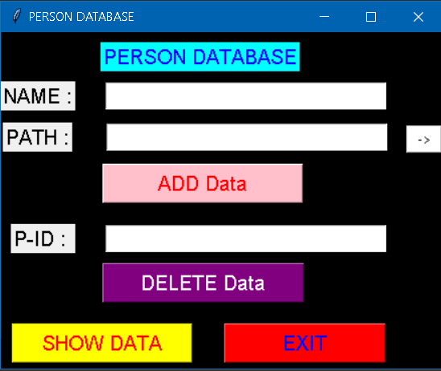

# FRAS
Face Recognition and Attendance System with

## Technology Used
- Opencv
- Face recongnition 
- Tkinter
- Sqlite

## Features
- Adding image data into database
- Face recognition
- Attendance System
- Retriving data of attending person/student from database in excel file(.xlsx)

## Screenshots
Output image for the given project is given as following:

